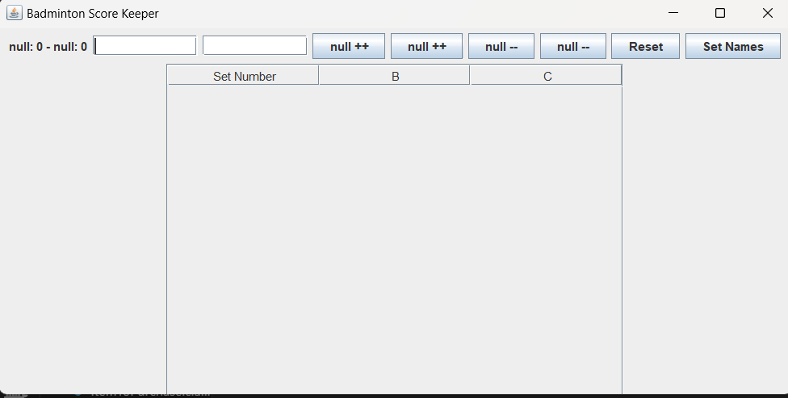

## Badminton Score Keeper

### Project Description
This is a digital Badminton Score Keeper (Scorekeeper? idk if I spelt it correctly lol)

This is the Java implementation, which uses Swing for the GUI.

This is the link to a similar project, but using HTML, CSS, JS, on CodePen, also made by me:

https://codepen.io/Fejo/full/eYojWbb

## Usage
To run the Java implementation, make sure to have Java installed. Then, run this command:

`java BadmintonScoreKeeper.java`

This will be the GUI that pops up. You can insert the player names and click Set Names.

After each set, the scores will be stored in the table automatically.

Enjoy!